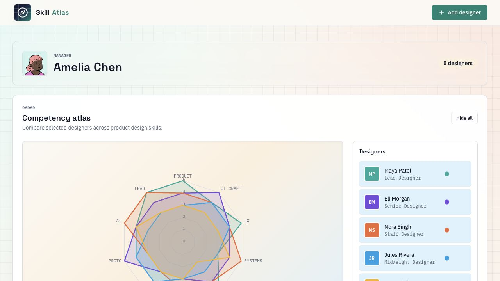
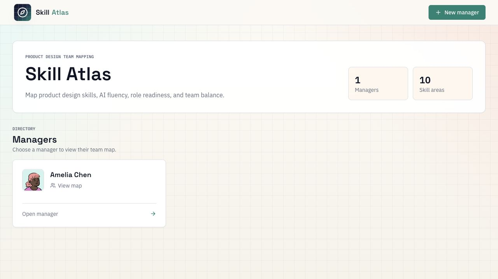

# Skill Atlas

Open source product design skill mapping for managers, leads, and teams.

Skill Atlas helps design leaders see the shape of a team: individual competency profiles, role maturity, role fit, archetype balance, and AI-augmented design capability. It is built as a practical starter app that you can clone, rename, customize, and publish for your own team.



## What It Does

- Map designers against 10 product design skill areas
- Compare skill shapes with an interactive radar chart
- Track role maturity and current role fit
- Group team members by Craft, Systems, and Strategy archetypes
- Create manager/team views with custom avatars
- Run immediately with a built-in demo dataset
- Switch to PostgreSQL persistence when `DATABASE_URL` is configured

## Quick Start

```bash
git clone https://github.com/doublethought/skill-atlas.git
cd skill-atlas
npm install
npm run dev
```

Open [http://localhost:5000](http://localhost:5000).

If port `5000` is already taken:

```bash
PORT=5001 npm run dev
```

## Screenshots

| Manager directory | Team skill map |
| --- | --- |
|  |  |

## Make It Yours

The app is intentionally easy to adapt:

- Rename the product in `client/src/components/BrandHeader.tsx`
- Change the skill model in `client/src/pages/Dashboard.tsx`
- Adjust levels and archetypes in `shared/schema.ts`
- Update add-designer defaults in `client/src/components/AddDesignerModal.tsx`
- Change colors, typography, and layout tokens in `client/src/index.css`
- Replace the favicon in `client/public/favicon.svg`
- Replace the README screenshots in `docs/images`

## Data And Persistence

By default, Skill Atlas runs without setup using in-memory demo data. This is ideal for trying the product, taking screenshots, or adapting the model before adding infrastructure.

For persistent data, copy the example environment file and add a PostgreSQL connection string:

```bash
cp .env.example .env
```

Then push the schema and run the app:

```bash
DATABASE_URL="postgresql://..." npm run db:push
DATABASE_URL="postgresql://..." npm run dev
```

The database layer uses Drizzle ORM and works with Neon-compatible PostgreSQL.

## Deploying

### Public Demo On Vercel

The repo includes a `vercel.json` that builds a static, read-only demo:

```bash
npm run build:demo
```

In this mode, Skill Atlas uses the bundled demo dataset in the browser and hides add/delete controls. This is the recommended setup for a public LinkedIn or website demo because visitors can explore the product without changing anything.

To deploy:

- Import `https://github.com/doublethought/skill-atlas` into Vercel
- Keep the default build settings from `vercel.json`
- Do not add `DATABASE_URL` for the public demo
- Share the Vercel URL as the live demo

### Full App On A Node Host

For a writable instance, Skill Atlas builds as a single Express server that serves both the API and the compiled React app.

Use these commands on platforms such as Render, Railway, Fly.io, or any Node host:

```bash
npm install
npm run build
npm run start
```

Set `DATABASE_URL` in your host environment if you want persistent data. Leave it unset for the in-memory demo mode.

## Tech Stack

- React 18
- TypeScript
- Vite
- Express
- Tailwind CSS
- shadcn/ui and Radix UI
- TanStack Query
- Recharts
- Drizzle ORM
- PostgreSQL / Neon-compatible database

## Scripts

```bash
npm run dev      # start the local development server
npm run build    # build client and server for production
npm run start    # run the production build
npm run check    # run TypeScript checks
npm run db:push  # push the Drizzle schema to PostgreSQL
```

## Publishing Checklist

- Update the GitHub URL in the clone command above
- Replace screenshots after any visual redesign
- Add your deployment URL to this README
- Use `docs/share-copy.md` as a starting point for LinkedIn or website copy
- Confirm `npm run check` and `npm run build` pass
- Keep `.env` private and use `.env.example` for public setup guidance

## License

MIT
